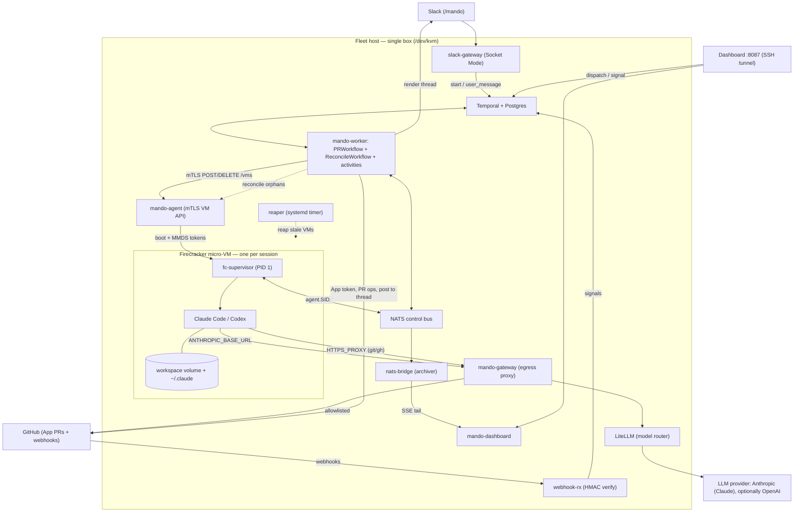

# Architecture

mandobox is **agent-runtime infrastructure**: a disposable computer for tasks. You hand it a
repository and a prompt; it boots a throwaway [Firecracker](https://firecracker-microvm.github.io/)
micro-VM, runs an AI coding agent inside it against that repo, and every task ends as a GitHub pull
request. When the PR is merged or closed, the VM and its workspace are destroyed.

This document is the public map of how the system actually fits together. For the reasoning behind
specific choices, see [decisions.md](decisions.md); for the knobs, see
[configuration.md](configuration.md).

## The one-box model

Everything runs on a **single dedicated host** with hardware virtualization (`/dev/kvm`): the
orchestration control plane, the micro-VM fleet, and every supporting service. There is no separate
control plane and no shared cluster — one machine runs it all. That keeps the moving parts few and the
security boundary sharp.

The unit of work is one **session**, identified by a ULID (`session_id`, e.g. `s_RX94WFYM…`). That one
identifier is threaded, unchanged, through everything: the Temporal workflow ID, the NATS subject
prefix, the git branch, the workspace volume filename, the jailer chroot, and the Slack thread. If you
know a session's ID, you can find every trace of it.

## Two trust zones

The design assumes the agent runs **unreviewed, possibly prompt-injected code** — so the boundary is
explicit:

- **Trusted host** — the control plane, orchestration, secrets, and networking policy.
- **Untrusted guest** — the Firecracker micro-VM where the agent and the repo's code actually run.

Nothing crosses that boundary except through three named interfaces: **MMDS** (the VM's read-only boot
metadata), the **NATS control bus** (scoped per session), and the **egress gateway** (the only way out
to the network). A guest cannot reach the host's other services, cannot reach another guest, and cannot
egress anywhere off the allowlist.

## Component map

Every process runs on the one host. The `cmd/` binaries:

| Process | Responsibility |
|---|---|
| **Temporal + PostgreSQL** | Durable workflow engine and its datastore — the source of truth for every session's state. |
| **mando-worker** | Runs the durable workflows (`PRWorkflow`, scheduled `ReconcileWorkflow`) and all their activities. |
| **mando-agent** | The host-side VM API (mTLS): launches and destroys Firecracker micro-VMs on request. |
| **mando-gateway** | The single egress proxy — splits LLM traffic from allowlisted git/registry traffic and injects the real provider key host-side. |
| **LiteLLM** | Model router behind the gateway: maps friendly model names to providers (Anthropic; optionally OpenAI). |
| **NATS + nats-bridge** | The per-session control bus; `nats-bridge` archives the event/log stream to disk. |
| **slack-gateway** | The Slack connector (Socket Mode) — turns `/mando` commands into workflow dispatches. |
| **webhook-rx** | Verifies GitHub webhook HMACs and turns PR/review events into workflow signals. |
| **mando-dashboard** | Local management + observability UI (localhost, reached over an SSH tunnel). |
| **mando-natsauth** | Generates the decentralized NATS auth material (operator/account) and per-session credentials. |
| **reaper** (systemd timer) | Host-level backstop that kills micro-VMs past their TTL or with a stale heartbeat. |
| **fc-supervisor** | PID 1 *inside* each guest — reads MMDS, sets up the workspace, and runs the agent. |

The internal packages mirror this: `control` (workflows + activities), `fleetagent` (the Firecracker
launcher), `gateway`, `natsauth`, `reconcile`, `session`, and `supervisor`.

## How it fits together

## Life of a task

1. **Dispatch** — a `/mando <repo> <prompt>` from Slack or a **New session** in the dashboard starts
   a `PRWorkflow` in Temporal, keyed by a fresh `session_id`.
2. **Prepare** — the workflow mints a short-lived, repo-scoped GitHub token, mints a per-session NATS
   credential, and creates the workspace volume.
3. **Launch** — an activity calls `mando-agent` over mTLS; `mando-agent` boots a Firecracker micro-VM
   (via the jailer) from the content-addressed golden image, passing boot config through **MMDS**.
4. **Boot** — inside the guest, `fc-supervisor` (PID 1) reads MMDS, mounts the workspace, clones the
   repo, and starts the agent (Claude Code by default).
5. **Run** — the agent works. All its LLM calls go out through the gateway (which injects the real
   key); its git/`gh` calls go through the same gateway against an allowlist. Progress streams over the
   `agent.<session_id>.*` NATS subjects.
6. **Open a PR** — the agent commits, pushes its branch, and opens a pull request. The workflow posts
   the PR back to the Slack thread.
7. **Review loop** — a review comment fires a GitHub webhook → `webhook-rx` verifies it → signals the
   workflow, which resumes the *same* session (workspace and agent transcript intact) to address the
   feedback.
8. **Teardown** — merging or closing the PR destroys the VM and the workspace. The durable workflow
   record in Temporal remains for history and cost accounting.

## The micro-VM guest

Each guest boots from a **content-addressed golden image** (`rootfs-<sha>.ext4`) built ahead of time
with Node, the agent CLIs, Go, and the language linters. `fc-supervisor` runs as PID 1 — there is no
systemd, sshd, or cloud-init inside. Boot configuration arrives via **MMDS** (Firecracker's read-only
metadata service), never baked into the image.

The **workspace volume** (`/workspace`, holding the repo, caches, and the agent's `~/.claude`
transcript) is the only mutable state that survives a VM's lifetime. That is what makes stateless
resume work: a review comment can boot a fresh VM that re-attaches the same workspace and continues the
same agent session.

The agent harness is pluggable — **Claude Code** is the default; **OpenAI Codex** is baked into the
image as a second harness (available, not yet verified end-to-end).

## Networking & egress

Each VM gets its own point-to-point tap device on a `/30`, with an **nftables deny-by-default** policy.
There is no shared bridge and no inbound path. A guest can talk to exactly two things, both through
`mando-gateway`:

- **LLM traffic** — the agent's `ANTHROPIC_BASE_URL` points at the gateway, which forwards to LiteLLM
  and on to the provider. The real provider key is injected host-side and never enters the guest.
- **git / registry traffic** — the agent's `HTTPS_PROXY` points at the same gateway, which permits only
  an allowlist (GitHub and package registries).

Guest-to-guest traffic is dropped. This is the property that lets untrusted code run safely.

## Secrets & credential tiers

- **Tier 0 — never in a guest.** The Anthropic key, the GitHub App private key, the NATS operator seed.
  These live on the host at `0600` and are used only host-side (e.g. key injection at the gateway).
- **Tier 1 — per-session, delivered at boot via MMDS.** The repo-scoped GitHub installation token and
  the session's NATS credential — scoped to `agent.<session_id>.>` so one session can never touch
  another's subjects.
- **Tier 2 — on-demand over NATS.** Material handed to a running guest only when needed (e.g. the VS
  Code attach token), delivered over the per-session-authenticated bus so only an actively-attached
  guest ever sees it.

## Steering & observability

The NATS bus carries `event`, `log`, and `heartbeat` streams per session. `nats-bridge` archives them
so a session's history survives its VM. The **dashboard** tails that stream over SSE — a live "connect
to agent" console — and can send a `user_message` signal back into a running session. The **Slack
thread** mirrors the same lifecycle, and an operator can **attach a browser VS Code** into a live VM
for hands-on inspection.

## Orphan reaping & failure recovery

Two independent mechanisms keep the fleet honest:

- The **host reaper** (a systemd timer) kills any Firecracker VM past its TTL or with a stale
  heartbeat — a fast, local backstop.
- The scheduled **ReconcileWorkflow** on the worker is Temporal-authoritative: it reconciles running
  VMs against live workflows and reaps anything with no owner, fail-closed.

Because the workspace volume is the only surviving mutable state, recovery is always "re-launch a VM and
re-attach the workspace."

## Adding a chat connector

Slack is one **chat connector** — the conversation surface a task is dispatched from and reports back
to. GitHub is different: it's the *substrate* (every task ends in a PR), not a swappable chat channel.
Adding another chat connector (Telegram, WhatsApp, Discord, …) is three small, independent pieces —
the workflow itself never changes:

1. **Outbound** — implement the `Notifier` interface (`internal/control/notify.go`): `Post` (start a
   thread / reply in one) and `Update`. Register it on the worker with `RegisterNotifier`. The workflow
   only ever calls the generic `PostMessage`/`UpdateMessage` activities against a `Conversation{Kind,
   Channel, Thread}`, so it routes to your connector automatically by `Kind`.
2. **Inbound** — write a small translator (mirror `cmd/slack-gateway`): receive the platform's events
   and turn them into the same two generic Temporal calls every dispatcher uses —
   `ExecuteWorkflow(PRWorkflow, WorkflowInput{Conversation: {Kind, Channel}})` to start, and
   `SignalWorkflow(SignalUserMessage, …)` to steer. Route a reply back to its workflow via a search
   attribute (as `slack-gateway` uses `slack_thread`).
3. **Config** — surface its secrets/setup on the dashboard's Connectors page.

The workflow stays connector-agnostic for **routing and delivery**: it holds a `Conversation` (not a
Slack channel) and routes replies by a namespaced `conversation` search attribute, so no workflow edit
is needed. The one remaining Slack-specific assumption is message **formatting** — the workflow emits
Slack-dialect text (mrkdwn + `:emoji:`), so a non-Slack connector's `Post` translates it. A
connector-neutral message model is a planned refinement.

## Configuration, deployment & further reading

- **Configuration** — box-wide `/etc/fleet/mandobox.yml` plus an optional per-repo `.mandobox.yml`,
  resolved and clamped per dispatch with no restart. See [configuration.md](configuration.md).
- **Deployment** — one dedicated box (`/dev/kvm` required, XFS root), provisioned by the Ansible roles.
  See the [operator runbook](runbook.md) and [server setup](hetzner-setup.md).
- **Design rationale** — why ephemeral compute + a persistent workspace + durable orchestration, and
  the notable deviations from the original plan, are recorded in [decisions.md](decisions.md).
